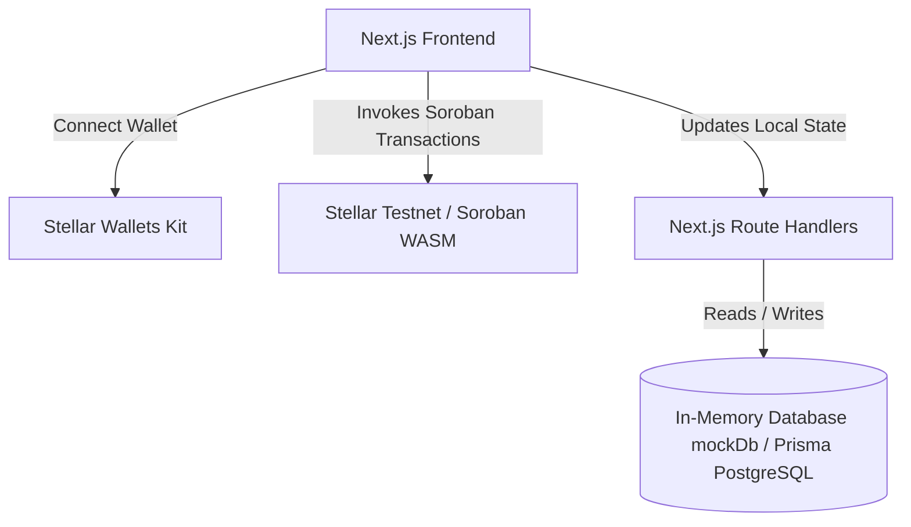

# TraceChain

> **Blockchain-Powered Supply Chain Provenance Platform**
> 
> TraceChain is a production-grade decentralized application (dApp) built on the Stellar Network using Soroban Smart Contracts. It provides manufacturers, logistics providers, distributors, retailers, and consumers with complete visibility into product lifecycles, ownership transfers, and shipment tracking on a tamper-proof ledger.

---

## Screenshots

### Landing Page


### Dashboard Analytics


### Admin Console


### Smart Contract Execution & Verification
<div style="display: flex; gap: 10px;">
  
  
</div>

---

## Architecture Overview



### Smart Contract Network Topology
The system runs four separate, modular smart contracts that interact using native Soroban cross-contract calls:
- **Partner Registry**: Governs business node registration, roles (Manufacturer, Distributor, Logistics, Retailer), and Admin approval state.
- **Product Registry**: Mints unique product batches and logs attributes. Checks approvals against Partner Registry.
- **Ownership**: Manages ownership custody transfer histories. Checks product existences and role validations.
- **Shipment**: Orchestrates freight schedules and carrier milestones. On delivery confirmation, it invokes the Ownership contract to transfer product custody to the receiver automatically.

---

## Folder Structure

```
contracts/
  partner-registry/       # Cargo package for Partner approvals
  product-registry/       # Cargo package for Product minting
  ownership/              # Cargo package for Custody logs
  shipment/               # Cargo package for Transit logs
  Cargo.toml              # Cargo workspace config
src/
  app/                    # Next.js App router pages & Route Handlers
    admin/                # Admin operations dashboard
    dashboard/            # Aggregated charts & metrics
    products/             # Manufacturer registration & list
    shipments/            # Carrier update checkpoints & dispatch
    inventory/            # Partner warehouse counts
    product/              # Public QR scanning & verification route
  components/             # UI Components (shadcn & Recharts)
  context/                # React Contexts (Wallet, Theme, Toast)
  services/               # Blockchain integration services
  lib/                    # Database (mockDb & Prisma Client)
  __tests__/              # Vitest units & context tests
prisma/
  schema.prisma           # Prisma PostgreSQL models
```

---

## Installation & Setup

### Prerequisites
- Node.js v18+ & npm
- Rust toolchain & `wasm32v1-none` target (for compiling Soroban contracts)
- Stellar CLI (for local network deployment)

### Local Setup
1. **Clone the Repository** and navigate to the project directory:
   ```bash
   npm install --legacy-peer-deps
   ```

2. **Configure Environment Variables**
   Create a `.env` file at the root:
   ```env
   # Admin Bypass Wallet Key
   ADMIN_WALLET_ADDRESS="GARS2PULJSSKHHVJKXLQFYMBU6ZSZCKQB7RV6Q5AQ7A4DA36DUUJLQ6E"

   # Soroban Pinned Contract IDs
   NEXT_PUBLIC_PARTNER_REGISTRY_ID="CB5TCZMC6AKOHMA22WQMGFWXVDWKCKVGIOYCHQDDLVRGDX7EXNR7KFB4"
   NEXT_PUBLIC_PRODUCT_REGISTRY_ID="CC2K63544EHBFCCJCQIT7IFXNZEW5OYIJ2STVNJCPJDNU5JVN4FVP6YA"
   NEXT_PUBLIC_OWNERSHIP_ID="CCTNSLRLMKEMKKIGCLEVKH26K2BWJT6GAT6KYYBT6E7WLIVZJT4FX5G6"
   NEXT_PUBLIC_SHIPMENT_ID="CAC6ORXZEHLBSKPJ34HGLQ2BWUXY3DFREOTE4G2R5LQYP2KBE5XHBOYT"
   ```

3. **Start Development Server**
   ```bash
   npm run dev
   ```

---

## Smart Contracts & Testing

### Cargo Unit Tests
Run the contract test suite in the Cargo workspace (automatically cleans and runs single-threaded to prevent compiler file locking contentions on Windows/macOS):
```bash
npm run test:contracts
```

### Frontend Unit Tests
Run the Vitest context and component test suite:
```bash
npm run test
```

---

## Demo Video
Watch the platform walk-through and transaction lifecycle demonstration:
👉 **[Watch the Video on YouTube](https://youtu.be/0eNuxyN4zmM)**

---

## Stellar Testnet Addresses
For testing and integration benchmarks:
- **Partner Registry Contract**: `CB5TCZMC6AKOHMA22WQMGFWXVDWKCKVGIOYCHQDDLVRGDX7EXNR7KFB4`
- **Product Registry Contract**: `CC2K63544EHBFCCJCQIT7IFXNZEW5OYIJ2STVNJCPJDNU5JVN4FVP6YA`
- **Ownership Contract**: `CCTNSLRLMKEMKKIGCLEVKH26K2BWJT6GAT6KYYBT6E7WLIVZJT4FX5G6`
- **Shipment Contract**: `CAC6ORXZEHLBSKPJ34HGLQ2BWUXY3DFREOTE4G2R5LQYP2KBE5XHBOYT`

---

## License
Distributed under the MIT License. See `LICENSE` for details.
